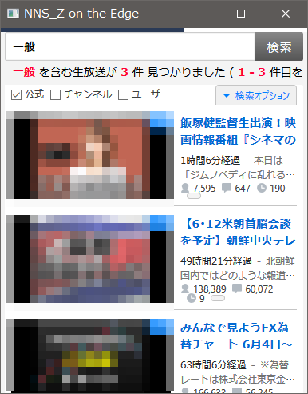

コンテンツ検索API廃止怒りの更新 
# NNS_Z ニコ生サーチ(雑) WV2

## 概要
[NNS_T](https://github.com/TN8001/NNS_T)が使用できなくなったので、仕方なくこちらを更新しましたorz

ついでに下記を使用  
[Microsoft.Web.WebView2](https://www.nuget.org/packages/Microsoft.Web.WebView2/)  
[CommunityToolkit.Mvvm](https://www.nuget.org/packages/CommunityToolkit.Mvvm/)

WinUI3も検討しましたが、現状MSIX限定なのでやめました（WPF .NET5）

## ライセンス
CC0 1.0 Universal

## 注意事項
* 一切責任は持ちません
* CSSはやっつけなので各自で好きにしてください
* 検索オプションは保存されません
* 実行ファイルのフォルダに設定ファイルを作るので書き込めるフォルダにしてください（Program Files等は避けてください）

---

### WebView2の感想
* ExecuteScriptAsyncはInvokeScriptAsyncより素直
* EnsureCoreWebView2Asyncがやや面倒
* そこそこイベントはあるが結局js
